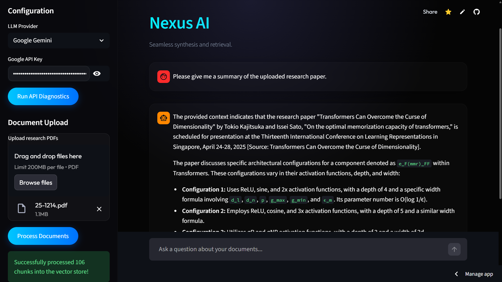
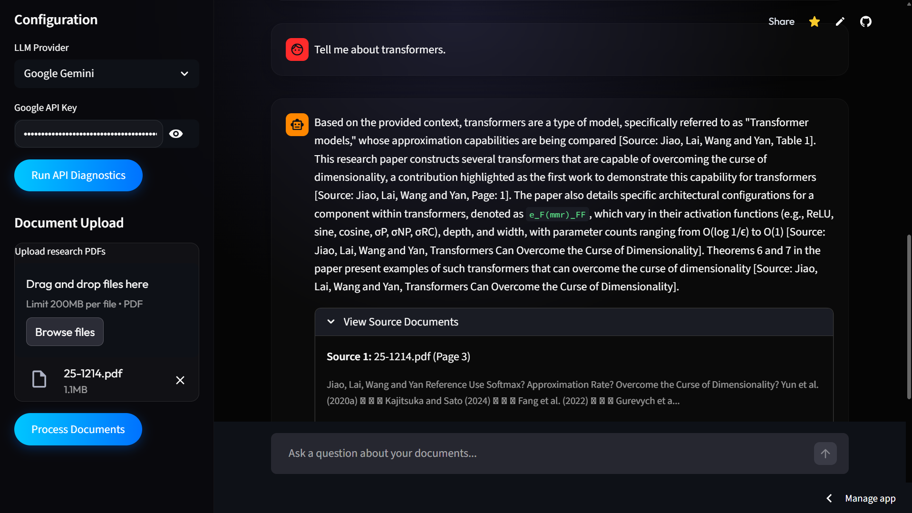

# Nexus AI — Personal Research Assistant

A Retrieval-Augmented Generation (RAG) powered research assistant that lets you upload PDFs and have intelligent, context-aware conversations about your documents using Google Gemini.

---

## 🎯 Problem Statement

In an era of information overload, extracting specific, relevant information from lengthy documents and research papers is time-consuming and prone to human error. Nexus AI solves this by allowing users to converse directly with their documents, instantly retrieving exact information with precise source citations.

## 🌐 Domain

**Artificial Intelligence / Natural Language Processing (NLP)**
Specifically, this project applies **Retrieval-Augmented Generation (RAG)** within the domain of document analysis, knowledge extraction, and intelligent information retrieval.

---

## Features

- **PDF Ingestion** — Upload multiple research papers and documents
- **Semantic Search** — Find the most relevant passages across all your documents
- **Conversational AI** — Ask follow-up questions with full chat history context
- **Citations** — Every answer includes source document and page references
- **Multi-provider LLM Support** — Works with Google Gemini, OpenAI, and Anthropic Claude

---

## Project Structure

```
personal-research-ai/
├── app.py                    # Streamlit application entry point
├── requirements.txt          # Python dependencies
├── src/
│   ├── document_processor.py # PDF loading and chunking
│   ├── vector_store.py       # ChromaDB vector database
│   └── rag_pipeline.py       # LangChain RAG chain
└── .gitignore
```

---

## Running Locally

**1. Clone the repo**
```bash
git clone https://github.com/HarishraghavanN/personal-research-ai.git
cd personal-research-ai
```

**2. Create a virtual environment and install dependencies**
```bash
python -m venv .venv
.venv\Scripts\activate
pip install -r requirements.txt
```

**3. Add your API key**
Create a `.env` file in the project root:
```
GOOGLE_API_KEY=your_google_api_key_here
```
Get your free key at: [https://aistudio.google.com/app/apikey](https://aistudio.google.com/app/apikey)

**4. Run the app**
```bash
streamlit run app.py
```

---

## Deployed App (Streamlit Cloud)

Live at: **<a href="https://personal-research-ai-diiururcwjx8nygkv2mur5.streamlit.app" target="_blank">https://personal-research-ai-diiururcwjx8nygkv2mur5.streamlit.app</a>**

To use: paste your Google Gemini API key in the sidebar → upload a PDF → click Process Documents → start asking questions!

---

## 🤖 Models Used

- **Primary Language Model (LLM)**: Google Gemini 2.5 Flash *(used for context-aware generation and conversational responses)*
- **Embedding Model**: HuggingFace `all-MiniLM-L6-v2` *(used for semantic search and converting document chunks into vectors)*

---

## 💻 Tech Stack

| Component | Technology |
|---|---|
| UI Framework | Streamlit |
| LLM Orchestration | LangChain |
| LLM Provider | Google Gemini 2.5 Flash |
| Vector Database | ChromaDB |
| Embeddings | HuggingFace (all-MiniLM-L6-v2) |
| Document Parsing | PyMuPDF |

---

## How it Works

1. **Ingest** — PDFs are parsed and split into overlapping text chunks
2. **Embed** — Each chunk is converted to a vector using a HuggingFace embedding model
3. **Store** — Vectors are stored in a local ChromaDB vector database
4. **Retrieve** — At query time, the top-k most semantically similar chunks are retrieved
5. **Generate** — Gemini reads the retrieved context and chat history to generate a cited answer

---

## 📸 Output / Screenshots

  
*Figure 1: Generating a summary from an uploaded research paper*

  
*Figure 2: Asking specific questions and receiving cited answers based on the document*
